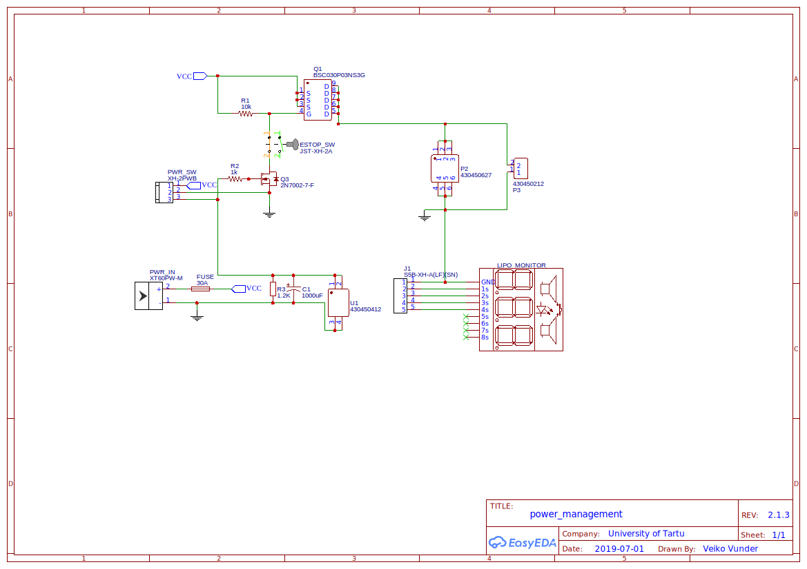
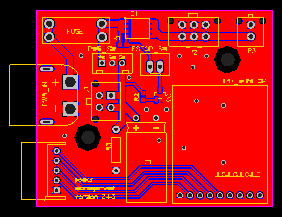
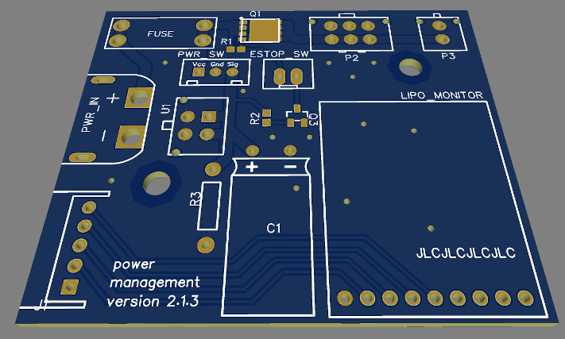

# robotont-electronics-power-management-board
The repository contains schematics and PCB layout for the Robotont power management board.
The [production](Production/) folder contains prepared gerbers with pos file ready to order a from e.g. JLCPCB.

## Schematics

## Layout

The following figures visualize the front side of the board along with the 3D model of the design.

